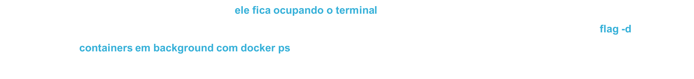
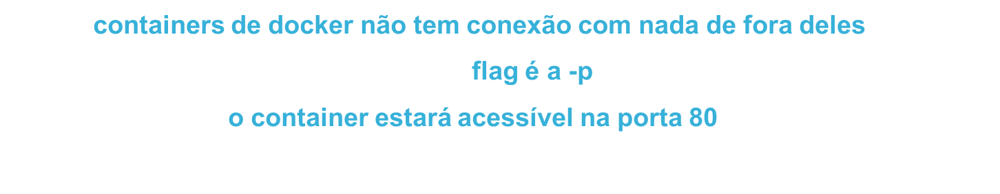
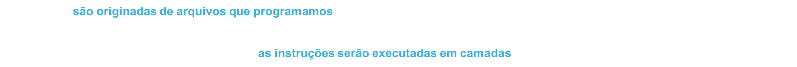

<h1 align="center">Estudo Docker</h1>

## O que são containers

- É um pacote de código que pode executar uma ação, por exemplo, rodar uma aplicação de Node.js, PHP, Python e etc.

- Containers utilizam imagens para poderem ser executados

- Múltiplos containers podem rodar juntos, por exemplo: um para PHP e outro para MySQL

## Container x Imagem

- Container: É o Docker rodando alguma imagem, consequentemente executando algum código proposto por ela

- O fluxo é: programamos uma imagem e a executamos por meio de um container

## Onde encontrar imagens?

- No próprio repositório do Docker: [Docker Hub](https://hub.docker.com)

- Vamos executar uma imagem em um container com o comando: `docker run <imagem>`

## Verificando containers executados

- O comando `docker ps` exibe quais containers estão sendo executados no momento

- Utilizando a flag `-a`, temos todos os containers já executados na máquina

- Este comando é útil para entender o que está sendo executado e acontece no nosso ambiente

## Executar container com interação

- Podemos rodar um container e deixa-lo executando no terminal

- Utilizando a flag: `-it`

## Container X VM (Virtual Machine)

- Container é uma aplicação que serve para um determinado fim, não possui sistema operacional, seu tamanho é de alguns mbs;

- VM possui sistema operacional próprio, tamanho de gbs, pode executar diversas funções ao mesmo tempo;

- Containers acabam gastando menos recursos para serem executados, por causa do seu uso específico;

- VMs gastam mais recursos, porém podem exercer mais funções;

## Executando container em background



## Expor portas



## Parando containers

- Utilize: `docker stop <id ou nome-do-container>`

## Iniciando containers

- Utilize: `docker start <id ou nome-do-container>`

## Dando nome a um container

- Utilize a flag `--name nome-do-container`

## Verificando os logs

- Utilize: `docker logs <id>`

## Removendo um container

- Utilize: `docker rm <id>`

- Caso o container esteja rodando, é só utilizar: `docker rm <id> -f`

## O que são imagens



## Como escolher uma imagem

- Podemos fazer download das imagens em: https://hub.docker.com;

- Porém qualquer um pode fazer upload de uma imagem, isso é um problema;

- Devemos então nos atentar as imagens oficiais;

- Outro parâmetro interessante é a quantidade de downloads e a quantidade de stars;

# Como criar uma imagem

- Para criar uma imagem vamos precisar de um arquivo Dockerfile em uma pasta que ficará o projeto;

- Este arquivo vai precisar de algumas instruções para poder ser executado;

`FROM`: imagem base;

`WORKDIR`: diretório da aplicação;

`EXPOSE`: porta da aplicação;

`COPY`: quais arquivos precisam ser copiados;

## Executando uma imagem

- Para executar precisamos usar o build: `docker build <diretório-da-imagem>`

- Depois vamos utilizar o: `docker run <>imagem`

## Alterando uma imagem

- Sempre que alterar uma imagem, é necessário fazer o build novamente.

- Para o docker, será uma imagem nova

- Após fazer o build, vamos executá-la por outro id único criada com o docker run;

## Camadas das imagens

- As imagens do docker são divididas em layers (camadas)

- Cada instrução no Dockerfile representa uma layer;

- Quando algo é atualizado apenas as layers depois da linha atualizada são refeitas;

- O resto permanece em cache, tornando o build mais rápido

## Fazendo download de imagens

- Podemos fazer o download de alguma imagem do hub e deixá-la disponível em nosso ambiente;

- Vamos utilizar o comando `docker pull <imagem>`;

- Desta maneira, caso se use em outro container, a imagem já estará pronta para ser utilizada;

## Múltiplas aplicações, mesmo container

- Podemos inicializar vários containers com a mesma imagem;

- As aplicações funcionarão em paralelo;

- Para testar isso, podemos determinar uma porta diferente para cada uma, e rodar no modo detached;

## Alterando o nome da imagem e tag

- Podemos nomear a imagem que criamos;

- Vamos utilizar o comando `docker tag <nome>` para isso;

- Também podemos modificar a tag, que seria como uma versão da imagem, semelhante ao git;

- Para inserir a tag utilizamos: `docker tag <nome>:<tag>`

## Iniciando imagem com um nome

- Podemos nomear a imagem já na sua criação;

- Vamos utilizar a flag `-t`;

- É possível inserir o nome e a tag, na sintaxe: `nome:tag`

- Isso torna o processo de nomeação mais simples;

## Comando start interativo

- A flag `-it` pode ser utilizada com o comando start também com a flag `-i`;

## Removendo imagens

- Para remover imagem deve utilizar: `docker rmi <imagem>`

- Para forçar a remoção utilize a flag `-f`: `docker rmi -f <imagem>`

## Removendo imagens e containers

- Com o comando: `docker system prune`

- Podemos remover imagens, containers e networks não utilizados;

- O sistema irá pedir uma confirmação para realizar a ação

## Removendo container após a utilização

- Um container pode ser automaticamente deletado após usa utilização

- Para isso vamos utilizar a flag `--rm`;

- O comando seria `docker run --rm <container>`

## Copiando arquivos do container

- Para fazer isso utilizamos: `docker cp`;

- Pode ser utilizado para copiar um arquivo de um diretório para um container;

- Ou de um container para um diretório determinado;

- Exemplo: `docker cp node_diferente:/app/app.js ./copia/`

## Verificando informações de processamento

- Para verificar dados de execução de um container utilizamos: `docker top <container>`

## Verificando dados de um container

- Para verificar diversas informações como: id, data de criação, imagem e muito mais;

- Utilizamos o comando: `docker inspect <container>`

## Verificando processamento do Docker

- Para verificar os processos que estão sendo executados em um container, utilizamos o comando: `docker stats`

## Enviando imagens para o Hub

- Para enviar uma imagem para o hub, devemos utilizar o: `docker push <imagem>`

- Porem antes deve ser criado o repositório para a imagem.

## Atualizando imagens no Hub

- Para atualizar uma imagem primeiro deve ser feito o build

- Troncando a tag da imagem para a versão atualizada

- Depois vamos fazer um push novamente para o repositório;

- Assim todas as versões estarão disponíveis para serem utilizadas

## Volumes

- É uma forma pratica de persistir dados em aplicações e não depender de containers para isso;

- Todo dado criado por um container é salvo nele, quando o container é removido, perdemos os dados;

- Então precisamos dos volumes para gerenciar os dados e também conseguir fazer backups de forma simples;

## Tipos de volumes

- **Anônimos (anonymous volume)**: Diretórios criados pela flag `-v`, porém com um nome aleatório

- **Nomeados (named volume)**: São volumes com nomes, podemos nos referir a estes facilmente e saber para que são utilizados no nosso ambiente;

- **Bind mounts**: Uma forma de salvar dados na nossa máquina, sem o gerenciamento do Docker, informamos um diretório para este fim;

## O problema da persistência

- Se criarmos um container com alguma image, todos os arquivos que geramos dentro dele serão do container

- Quando o container for removido, perdemos estes arquivos

- Por isso precisamos de **volumes**;

## Volumes anônimos

- Criar: `docker run -v /data`

- Onde /data será o diretório atrelado ao volume anonimo

- Para ver os volumes anônimos: `docker volume ls`

## Volumes nomeados

- Criar: `docker run -v nome-do-volume:/data`

- Em `docker volume ls` podemos verificar o container nomeado criado;

- Da mesma maneira que p anônimo, este volume tem como função armazenar arquivos;

**A pasta do volume deve ser a mesma da `WORKDIR`**

## Bind mounts

- É um tipo de volume, porém fica em um diretório da maquina HOST;

- Então não criamos um volume, apontaremos um diretório

- Criar: `docker run -v /dir/data:/data`

**Atenção: `dir/data` é a pasta que iremos escolher para salvar, caso a pasta escolhida esteja em outro local, deveremos utilizar o PATH dela, exemplo: C:\pasta-a-salvar\\**

- O Bind mount não serve apenas para volumes, podemos utilizar esta técnica para atualização em tempo real do projeto sem ter que refazer o build a cada atualização.

## Mais sobre volumes

### Criar volume manualmente

- Podemo criar volumes manualmente também utilizando:

- `docker volume create <nome>`

- Desta maneira temos um named volume criado, podemos atrelar a algum container na execução do mesmo;

### Listando todos os volumes

- `docker volume ls`: lista todos os volumes

### Checar um volume

- `docker volume inspect <nome>`

### Removendo volumes

- `docker volume rm <nome>`: Ao utilizar o comando, todos os dados serão removidos

- Removendo volumes em massa:

- `docker volume prune`

### Volume somente leitura

- Para criar um volume com apenas a permissão de leitura utilizamos:

- `docker run -v volume:/data:ro`

## Networks no Docker

- É uma forma de gerenciar a conexão do Docker com outras plataformas ou até mesmo entre containers

- As redes ou networks são criadas separadas do containers, como os volumes;

- Além disso existem alguns drivers de rede

- Uma rede deixa muito simples a comunicação entre containers

## Tipos de conexão

- **Externa**: conexão com uma API de um servidor remoto;

- **Com o host**: comunicação com a máquina que está executando o Docker;

- **
Entre containers**: comunicação que utiliza o driver bridge e permite comunicação entre dois ou mais containers

## Tipos de Rede (drivers)

- **Bridge**: O mais comum e o default do Docker, utilizado quando containers precisam se conectar

- **host**: permite a conexão entre um container e a máquina que está hosteando o Docker

- **macvlan**: permite a conexão a um container por um MAC address

- **none**: remove todas as conexões de rede de um container

- **plugins**: permite extensões de terceiros para criar outras redes

## Listando networks

- Para verificar todas as redes utilize: `docker network ls`

- Algumas redes já estão criadas, elas fazem parte da configuração inicial do docker

## Criando rede

- Utilizamos `docker network create <nome>`

- Está rede será do tipo bridge, que é o mais utilizado

- Podemos criar diversas redes

## Removendo redes

- Para remover uma rede utilize: `docker network rm <nome>`

- Assim a rede não estará mais disponível para utilizarmos

- Devemos tomar cuidado com os containers já conectados

- Para remover redes em massa utilizamos: `docker network prune`

## Instalando o Postman

- Vamos criar uma API para testar a conexão entre containers;

- Para isso vamos utilizar o software [Postman](https://www.postman.com), que é o mais utilizado do mercado para desenvolvimento de APIs;

- Link: https://www.postman.com

## Conexão com o Host

- Para conectar um container com o Host do docker utilizamos o ip: host.docker.internal

## Conexão entre containers

- Para conectar containers é necessário ter uma rede **bridge** para fazer esta conexão.

## Conectar container

- Para conectar um container a uma rede utilizamos o comando:

- `docker network connect <rede> <container>`

## Desconectando um container

- Para desconectar um container utilizamos:

- `docker network disconnect <rede> <container>`

## Inspecionando redes

- Para inspecionar uma rede utilizamos:

- `docker network inspect <rede>`

## Introdução à YAML

Yaml é uma linguagem de serialização (configuração), utilizada geralmente para arquivos de configuração, inclusive do Docker, para configurar o Docker compose. As extensões de seus arquivos são: .yml ou .yaml

## Criando arquivo YAML

- O arquivo geralmente possui valores e chaves que é de onde vamos retirar as configurações do nosso sistema.

## Identação no YAML

- O fim de uma linha indica o fim de uma instrução, não há ponto e virgula.

- A identação deve conter um ou mais espaços, e não devemos utilizar tab.

- E cada uma define um novo bloco

- O espaço é obrigatório após a declaração da chave

## Comentários no YAML

- Para comentar no arquivo utilizamos o " # "

## Dados numéricos

- Int = 2

- Float = 2.1

## Strings

- **Sem aspas**: Este é um texto válido

- **Com aspas**: Este também

## Valores nulos

- **Dados nulos**: `~` ou `null`

## Boolean

- `True` e `On` = Verdadeiro

- `False` e `Off` = Falso

## Listas

- Primeira: `[1, 2, 3, 4, 5]`

- Segunda: 
```yaml
items:
  - 1
  - 2
  - 3
```
## Dicionários

- Primeira: `{a: 1, b: 2, c: 3}`

- Segunda:
```yaml
objeto:
  chave a: 1
  chave b: 2
```
## Docker Compose

- Docker Compose é uma ferramenta para rodar múltiplos containers

- Esta operação é orquestrada por um arquivo de configuração

- É uma forma de rodar múltiplos builds e runs com um comando

- Em projetos maiores é essencial o uso do Compose

## Criando o Compose

- Primeiramente deve ser criado o arquivo: **docker-compose.yml** na raiz do projeto

- Este arquivo irá coordenar os containers e imagens, e possui algumas chaves muito utilizadas

- **version**: Versão do Compose

- **services**: Containers/serviços que vão rodar nesta aplicação

- **volumes**: Possível adição de volumes

## Rodando o Compose

- Para rodar o arquivo utilizamos: `docker compose up`